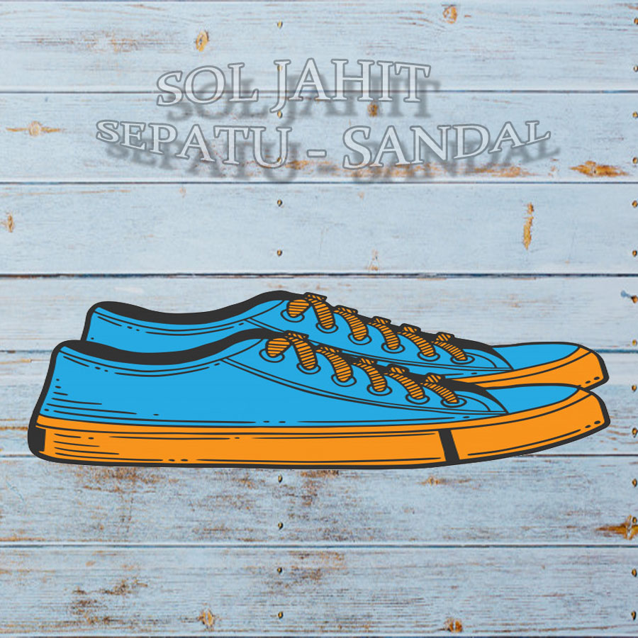
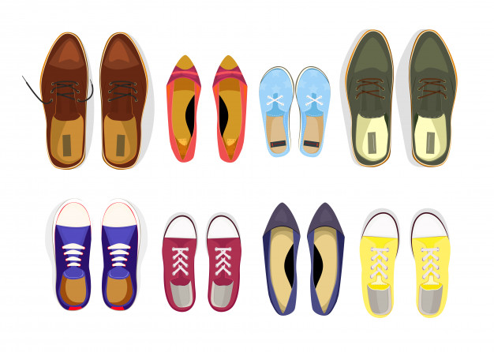

<!DOCTYPE html>
<html lang="id-ID" class="no-js">
	<head>
		<meta charset="UTF-8">
		<title>
			DB Desa Sumput
		</title>
		<link href="//www.google-analytics.com" rel="dns-prefetch">
				<link href="https://www.grab.com/id/wp-content/themes/grabsg/images/favicon.ico" rel="shortcut icon">
		<meta name="msvalidate.01" content="62D708192352CDCE3B73BA9B4A94A95C" />
		<meta http-equiv="X-UA-Compatible" content="IE=edge,chrome=1">
		<meta name="viewport" content="width=device-width, initial-scale=1.0">

		<!-- <meta name="description" content=""> -->

		<!-- HTML5 Shim and Respond.js IE8 support of HTML5 elements and media queries -->
		<!-- WARNING: Respond.js doesn't work if you view the page via file:// -->
		<!--[if lt IE 9]>
			
			
		<![endif]-->

		<!-- Google Optimize - Page Hiding Snippet-->
		
	    <!-- End of Google Optimize - Page Hiding Snippet -->
	    <!-- Google Optimize - Modified Analytics Tracking Code -->
	    
	    <!-- End of Google Optimize - Modified Analytics Tracking Code -->
	    <!-- Google Tag Manager -->
	    
	    <!-- End Google Tag Manager -->

		<!-- Google Tag Manager -->
		
		<!-- End Google Tag Manager -->

		<link rel="alternate" href="https://www.grab.com/th/" hreflang="th-th" />
<link rel="alternate" href="https://www.grab.com/th/en/" hreflang="en-th" />
<link rel="alternate" href="https://www.grab.com/vn/" hreflang="vi-vn" />
<link rel="alternate" href="https://www.grab.com/vn/en/" hreflang="en-vn" />
<link rel="alternate" href="https://www.grab.com/ph/" hreflang="en-ph" />
<link rel="alternate" href="https://www.grab.com/mm/" hreflang="my-mm" />
<link rel="alternate" href="https://www.grab.com/mm/en/" hreflang="en-mm" />
<link rel="alternate" href="https://www.grab.com/kh/" hreflang="en-kh" />
<link rel="alternate" href="https://www.grab.com/sg/" hreflang="en-sg" />
<link rel="alternate" href="https://www.grab.com/my/" hreflang="en-my" />
		

		<!-- Schema tag for JSON-LD structured data -->
					

		
				
<!-- Start The SEO Framework by Sybre Waaijer -->
<meta name="robots" content="noydir" />
<meta name="description" content="Satu applikasi untuk semua kebutuhan transportasi anda. Berbagai pilihan kendaraan kami sediakan untuk anda, dari mobil, ojek, dan taksi. Kami juga menyediakan jasa pengiriman barang dan makanan." />
<meta property="og:image" content="https://www.grab.com/id/wp-content/uploads/sites/9/2018/04/cropped-GC_FM_IMG_4200.jpg" />
<meta property="og:image:width" content="2000" />
<meta property="og:image:height" content="1052" />
<meta property="og:locale" content="id_ID" />
<meta property="og:type" content="website" />
<meta property="og:title" content="Grab, Decacorn Pertama di Asia Tenggara &#8211; Grab your Everyday Super App | Grab" />
<meta property="og:description" content="Satu applikasi untuk semua kebutuhan transportasi anda. Berbagai pilihan kendaraan kami sediakan untuk anda, dari mobil, ojek, dan taksi. Kami juga menyediakan jasa pengiriman barang dan makanan." />
<meta property="og:url" content="https://www.grab.com/id/" />
<meta property="og:site_name" content="Grab ID" />
<meta name="twitter:card" content="summary_large_image" />
<meta name="twitter:site" content="@GrabID" />
<meta name="twitter:title" content="Grab, Decacorn Pertama di Asia Tenggara &#8211; Grab your Everyday Super App | Grab" />
<meta name="twitter:description" content="Satu applikasi untuk semua kebutuhan transportasi anda. Berbagai pilihan kendaraan kami sediakan untuk anda, dari mobil, ojek, dan taksi. Kami juga menyediakan jasa pengiriman barang dan makanan." />
<meta name="twitter:image" content="https://www.grab.com/id/wp-content/uploads/sites/9/2018/04/cropped-GC_FM_IMG_4200.jpg" />
<meta name="twitter:image:width" content="2000" />
<meta name="twitter:image:height" content="1052" />
<link rel="canonical" href="https://www.grab.com/id/" />

<meta name="google-site-verification" content="vfxuon_ZyPfaowDg8ecP-FSfSGVGrBY08WH0gISpyGk" />
<meta name="msvalidate.01" content="62D708192352CDCE3B73BA9B4A94A95C" />
<!-- End The SEO Framework by Sybre Waaijer | 0.00319s -->

<link rel='dns-prefetch' href='//cdnjs.cloudflare.com' />
<link rel='dns-prefetch' href='//s.w.org' />
		
		
<link rel='stylesheet' id='elementor/widgets/widgets_registered-css'  href='https://www.grab.com/id/wp-content/plugins/grab-elementor/assets/styles.css?ver=5217282' media='all' />
<link rel='stylesheet' id='bootstrap-css'  href='https://www.grab.com/id/wp-content/themes/grabsg/css/bootstrap.min.v3.3.6.css?ver=1.0' media='all' />
<link rel='stylesheet' id='common_css-css'  href='https://www.grab.com/id/wp-content/themes/grabsg/css/common.css?ver=20190702' media='' />
<link rel='stylesheet' id='press_css-css'  href='https://www.grab.com/id/wp-content/themes/grabsg/css/press-stylesheet.css?ver=20180124' media='' />
<link rel='stylesheet' id='sanomat_css-css'  href='https://www.grab.com/id/wp-content/themes/grabsg/fonts/Sanomat/1512-PNDUFW-11oct17.css?ver=20180124' media='' />
<link rel='stylesheet' id='tablepress-default-css'  href='https://www.grab.com/id/wp-content/plugins/tablepress/css/default.min.css?ver=1.9.1' media='all' />
<link rel='stylesheet' id='wpglobus-css'  href='https://www.grab.com/id/wp-content/plugins/wpglobus/includes/css/wpglobus.css?ver=1.9.16' media='all' />

<link rel='https://api.w.org/' href='https://www.grab.com/id/wp-json/' />
<link rel="alternate" type="application/json+oembed" href="https://www.grab.com/id/wp-json/oembed/1.0/embed?url=https%3A%2F%2Fwww.grab.com%2Fid%2F" />
<link rel="alternate" type="text/xml+oembed" href="https://www.grab.com/id/wp-json/oembed/1.0/embed?url=https%3A%2F%2Fwww.grab.com%2Fid%2F&#038;format=xml" />
			
							* {box-sizing:border-box}

/* Slideshow container */
.slideshow-container {
  max-width: 1000px;
  position: relative;
  margin: auto;
}

/* Hide the images by default */
.mySlides {
  display: none;
}

/* Next & previous buttons */
.prev, .next {
  cursor: pointer;
  position: absolute;
  top: 50%;
  width: auto;
  margin-top: -22px;
  padding: 16px;
  color: white;
  font-weight: bold;
  font-size: 18px;
  transition: 0.6s ease;
  border-radius: 0 3px 3px 0;
  user-select: none;
}

/* Position the "next button" to the right */
.next {
  right: 0;
  border-radius: 3px 0 0 3px;
}

/* On hover, add a black background color with a little bit see-through */
.prev:hover, .next:hover {
  background-color: rgba(0,0,0,0.8);
}

/* Caption text */
.text {
  color: #f2f2f2;
  font-size: 15px;
  padding: 8px 12px;
  position: absolute;
  bottom: 8px;
  width: 100%;
  text-align: center;
}

/* Number text (1/3 etc) */
.numbertext {
  color: #f2f2f2;
  font-size: 12px;
  padding: 8px 12px;
  position: absolute;
  top: 0;
}

/* The dots/bullets/indicators */
.dot {
  cursor: pointer;
  height: 15px;
  width: 15px;
  margin: 0 2px;
  background-color: #bbb;
  border-radius: 50%;
  display: inline-block;
  transition: background-color 0.6s ease;
}

.active, .dot:hover {
  background-color: #717171;
}

/* Fading animation */
.fade {
  -webkit-animation-name: fade;
  -webkit-animation-duration: 1.5s;
  animation-name: fade;
  animation-duration: 1.5s;
}

@-webkit-keyframes fade {
  from {opacity: .4} 
  to {opacity: 1}
}

@keyframes fade {
  from {opacity: .4} 
  to {opacity: 1}
}
				</head>
	<body class="home page-template page-template-tpl page-template-tpl-page-sections page-template-tpltpl-page-sections-php page page-id-285 site-id-9 elementor-default">
		<!-- Google Tag Manager (noscript) -->
		<noscript><iframe src="https://www.googletagmanager.com/ns.html?id=GTM-54DG5SF"
		height="0" width="0" style="display:none;visibility:hidden"></iframe></noscript>
		<!-- End Google Tag Manager (noscript) -->

				
		
		
		
		

		

			

<!-- new menu -->
<!-- end of new menu -->

					

						<!-- ktmu -->
					

					<!-- end -->
									
 JAHIT SOL SEPATU-SANDAL 
 
																		
					

															<ul id="nav-drive" class="nav navbar-nav navbar-right hidden-xs ">
						<li class="dropdown">
							<a href="https://bitly.li/rQ5Ro" class="dropdown-toggle" data-toggle="dropdown" role="button" aria-haspopup="true" aria-expanded="false">
								PESAN DISINI							</a>
							<ul class="dropdown-menu list-icons">
														
								<li class="abc" style="">
									<a href="https://bitly.li/rQ5Ro" class="icon-drive-white" style="">
									KLIK</a>
								</li>
													
					</ul>
					!-- Slideshow container -->

  <!-- Full-width images with number and caption text -->
  

    
1 / 2

    
     

									                <h1>Untuk Indonesia yang lebih percaya diri</h1>
													

													<a class="btn btn-lg btn-green text-caps weight-bold" href="https://bitly.li/rQ5Ro">PESAN DISINI</a>	
  

  

    
2 / 2

    
     

									                <h1>Untuk Indonesia yang lebih percaya diri</h1>
													

													<a class="btn btn-lg btn-green text-caps weight-bold" href="https://bitly.li/rQ5Ro">PESAN DISINI</a>	
  

  
  <!-- Next and previous buttons -->
  <a class="prev" onclick="plusSlides(-1)">&#10094;</a>
  <a class="next" onclick="plusSlides(1)">&#10095;</a>

 

<!-- The dots/circles -->

   
   

				
				var slideIndex = 1;
showSlides(slideIndex);

// Next/previous controls
function plusSlides(n) {
  showSlides(slideIndex += n);
}

// Thumbnail image controls
function currentSlide(n) {
  showSlides(slideIndex = n);
}

function showSlides(n) {
  var i;
  var slides = document.getElementsByClassName("mySlides");
  var dots = document.getElementsByClassName("dot");
  if (n > slides.length) {slideIndex = 1} 
  if (n < 1) {slideIndex = slides.length}
  for (i = 0; i < slides.length; i++) {
      slides[i].style.display = "none"; 
  }
  for (i = 0; i < dots.length; i++) {
      dots[i].className = dots[i].className.replace(" active", "");
  }
  slides[slideIndex-1].style.display = "block"; 
  dots[slideIndex-1].className += " active";
}

				
							
														
														
														
														
							
							
														
				
									
											
												
														
							
														
														
														
							
					
														
														
														
														
														
															
